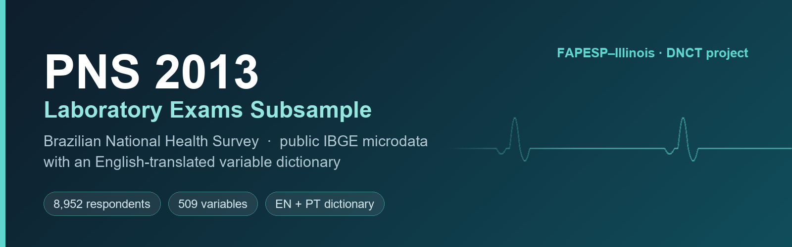

<p align="center">
  
</p>

<h1 align="center">PNS 2013 — Laboratory Exams Subsample</h1>

<p align="center">
  <em>Public Brazilian National Health Survey microdata, with an English-translated variable dictionary</em>
</p>

<p align="center">
  
  
  
  
</p>

---

## What this is

The **Pesquisa Nacional de Saúde (PNS) 2013** is Brazil's national household health survey, run by
[IBGE](https://www.ibge.gov.br/) in partnership with the Ministry of Health. A subsample of
respondents underwent **blood and urine collection plus physical measurement** — the laboratory
exams subsample published here.

This repository is a **convenience release**: the data are already public, and nothing has been
added to them. What this repository contributes is an **English translation of the variable
dictionary**, so the survey is workable by non-Portuguese-speaking researchers without having to
translate 500+ variable definitions first.

> **No new data.** Every record here comes from IBGE's public release. There are no direct
> identifiers — respondents are represented only by survey variable codes.

## Repository contents

| Path | What it holds |
|---|---|
| `data/pns2013_lab_exams.xlsx` | The laboratory exams subsample — 8,952 respondents × 509 variables, including the survey weight (`peso_lab`) |
| `dictionaries/variable_dictionary_EN.xlsx` | **Variable dictionary translated to English** — codes, descriptions, and category labels |
| `dictionaries/dicionario_de_variaveis_PT.xlsx` | The original Portuguese dictionary, for reference and verification |
| `pipeline/` | Analysis code from the study that motivated this release (see below) |

### Reading the data

Variable names are **PNS codes**, not English words — they are language-neutral by design
(`W00407` = systolic blood pressure, `C008` = age, `Z001`… = laboratory results). Use the English
dictionary to resolve them:

```python
import pandas as pd

df = pd.read_excel("data/pns2013_lab_exams.xlsx")
dic = pd.read_excel("dictionaries/variable_dictionary_EN.xlsx", sheet_name=" Plan2")

df.shape        # (8952, 509)
```

Blocks you will find: laboratory results (`Z*`), sociodemographics (`C*`, `E*`), lifestyle
(`P*`), chronic conditions (`Q*`), health-service access (`J*`), anthropometry and blood pressure
(`W*`), and sleep (`X*`).

## Analysis code

`pipeline/` contains the modelling code from the **FAPESP–Illinois DNCT Project**, which used this
subsample to predict *measured* hypertension (systolic ≥ 140 or diastolic ≥ 90 mmHg) rather than
self-reported diagnosis.

| File | Purpose |
|---|---|
| `pns2013_hypertension_pipeline2.py` | Registry-driven feature build with an explicit leakage audit. Scenarios: `all`, `undiagnosed`, `nondiagnosis`; flags: `prune`, `noexam`, `fast`, `dropbp`, `droptier1`, `dump` |
| `pipeline3_generic.py` | Splines, ordinal encoding, nested CV, calibration, SHAP, figures |
| `METHODS_LOG.md` | Methodological log — decisions taken, and the mistakes caught along the way |

Paths resolve relative to the repository root, so the pipeline runs from a fresh clone with no
editing. Override them with the `PNS2013_DATA` / `PNS2013_DIC` environment variables if your copy
of the data lives elsewhere.

```bash
git clone https://github.com/isasaade-23/pns2013-lab-exams-en.git
cd pns2013-lab-exams-en
python pipeline/pns2013_hypertension_pipeline2.py undiagnosed prune
```

There is also a **Colab notebook** that runs the whole pipeline, clones this repository for its
data, produces figures, and bundles every result into a downloadable `.zip`.

`METHODS_LOG.md` is worth reading before reusing the pipeline. It records, among other things, an
outcome-leakage bug in which a medication counter was computed before the hypertension-medication
variable was dropped — inflating AUC to 0.86 with sensitivity 1.000 before correction to 0.784.

## Researchers

| Researcher | Affiliation |
|---|---|
| **Isabela Venancio da Silva** | Universidade de São Paulo (USP), São Paulo |
| **Xuan Lin** | University of Illinois Urbana-Champaign (UIUC) |
| **Amogh Mannava** | University of Illinois Urbana-Champaign (UIUC) |

## Citation

Please cite the original survey as the data source:

> Instituto Brasileiro de Geografia e Estatística (IBGE). *Pesquisa Nacional de Saúde 2013.*
> Rio de Janeiro: IBGE, 2014.

And, if the English dictionary was useful, this repository alongside it.

## License

The underlying PNS 2013 microdata are public and distributed by IBGE under its own terms; consult
[IBGE](https://www.ibge.gov.br/estatisticas/sociais/saude/9160-pesquisa-nacional-de-saude.html)
for the authoritative release and conditions of use.

The **English translation of the variable dictionary** and the **analysis code** in this
repository are released under [CC BY 4.0](LICENSE) and the MIT License respectively.
